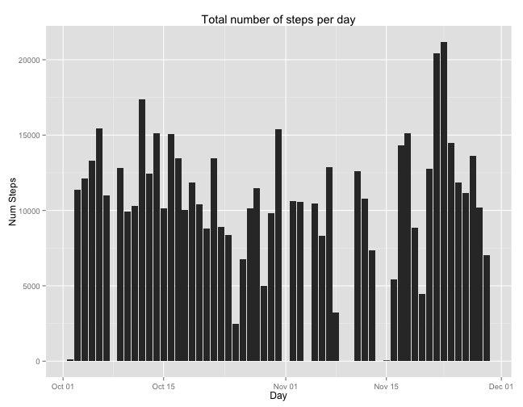
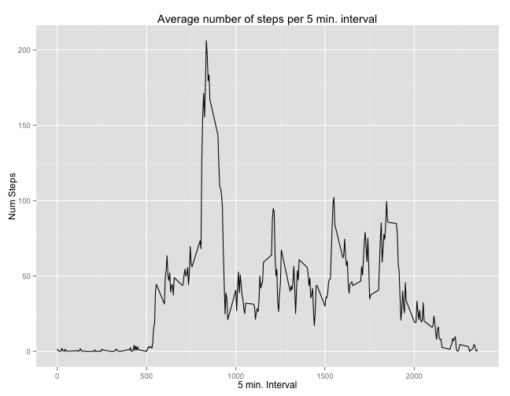
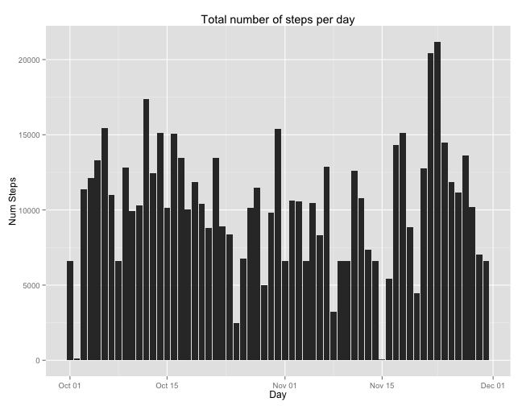
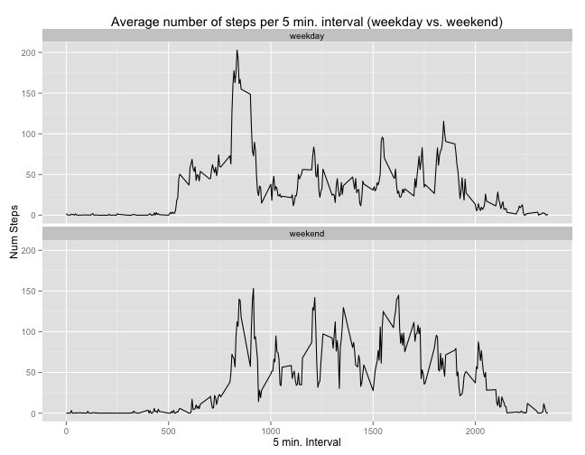

# Reproducible Research: Peer Assessment 1

This assignment makes use of data from a personal activity monitoring device. This device collects data at 5 minute intervals through out the day. The data consists of two months of data from an anonymous individual collected during the months of October and November, 2012 and include the number of steps taken in 5 minute intervals each day.

## Loading and preprocessing the data

The variables included in this dataset are:

- steps: Number of steps taking in a 5-minute interval (missing values are coded as NA)
- date: The date on which the measurement was taken in YYYY-MM-DD format
- interval: Identifier for the 5-minute interval in which measurement was taken

The dataset is stored in a comma-separated-value (CSV) file and there are a total of 17,568 observations in this dataset.


```r
library(lubridate, warn.conflicts=FALSE)
activityData <- read.csv("activity.csv")
activityData <- transform(activityData, date=ymd(date))
# get the data set without the missing values
activityStepData <- subset(activityData, !is.na(activityData$steps))
```

## What is mean total number of steps taken per day?

The following histogram shows the total number of steps taken each day (missing values are ignored).


```r
library(ggplot2, warn.conflicts=FALSE)
totalStepData <- aggregate(activityStepData$steps, list(activityStepData$date), sum)
colnames(totalStepData) <- c("day", "steps")

plot <- ggplot(totalStepData, aes(x=day))+labs(title="Total number of steps per day", x="Day", y="Num Steps")
plot+geom_bar(aes(y=steps), stat="identity")
```

 

Calculate the mean and median total number of steps taken per day:


```r
meanTotalSteps <- mean(totalStepData$steps)
medianTotalSteps <- median(totalStepData$steps)
```

The mean total number of steps taken per day: <b>10766.19</b><br/>
The median total number of steps taken per day: <b>10765.00</b>

## What is the average daily activity pattern?

The following plot shows the 5-minute interval (x-axis) and the average number of steps taken, averaged across all days (y-axis).


```r
intervalMeanData <- aggregate(activityStepData$steps, list(activityStepData$interval), mean)
colnames(intervalMeanData) <- c("interval", "steps")

plot <- ggplot(intervalMeanData, aes(x=as.numeric(interval)))
plot <- plot+labs(title="Average number of steps per 5 min. interval", x="5 min. Interval", y="Num Steps")
plot+geom_line(aes(y=steps))
```

 

Select the interval with the maximal number of steps:


```r
maxInterval <- subset(intervalMeanData, intervalMeanData$steps == max(intervalMeanData$steps))
```

Most activity happens in the interval after <b>835</b> minutes.

## Imputing missing values

Get the data set with only the missing values:


```r
activityNoStepData <- subset(activityData, is.na(activityData$steps))
```

There are <b>2304</b> records that have no number of steps defined.

To substitute the missing values for an interval the mean value of that interval across all days is taken. If no values are found for that interval (i.e. no steps were measured for that interval) 0 is taken.


```r
library(plyr, warn.conflicts=FALSE)
activityNoStepData$steps <- apply(activityNoStepData, 
                                  1, 
                                  function(x) { m <- mean(subset(activityStepData$steps, activityStepData$interval == x["interval"], "steps")); ifelse(is.nan(m), 0, m) })
newActivityData <- arrange(rbind(activityStepData, activityNoStepData), date, interval)
```

The following plot is a histogram displaying the new total number of steps taken each day.


```r
newTotalStepData <- aggregate(newActivityData$steps, list(newActivityData$date), sum)
colnames(newTotalStepData) <- c("day", "steps")

plot <- ggplot(newTotalStepData, aes(x=day))
plot <- plot+labs(title="Total number of steps per day", x="Day", y="Num Steps")
plot+geom_bar(aes(y=steps), stat="identity")
```

 

Calculate the new mean and median total number of steps taken per day:


```r
meanNewTotalSteps <- mean(newTotalStepData$steps)
medianNewTotalSteps <- median(newTotalStepData$steps)
```

The new mean total number of steps taken per day: <b>10221.93</b> (vs. <b>10766.19</b>)<br/>
The new median total number of steps taken per day: <b>10395.00</b> (vs. <b>10765.00</b>)

As one can see the values for the data set with substituted missing values have decreased.

## Are there differences in activity patterns between weekdays and weekends?

A new factor column for the classification "weekend" vs. "weekday" is added to the data set:


```r
newActivityData$day <- factor(apply(newActivityData, 
                                    1, 
                                    function(x) { d <- wday(x["date"]); ifelse(d == 1 | d == 7, "weekend", "weekday") }))
```

The following plots shows the 5-minute interval (x-axis) and the average number of steps taken (y-axis), averaged across all weekdays [plot 1] and across all weekend days [plot 2].


```r
intervalMeanData <- aggregate(newActivityData$steps, list(newActivityData$day, newActivityData$interval), mean)
colnames(intervalMeanData) <- c("day", "interval", "steps")

plot <- ggplot(intervalMeanData, aes(x=as.numeric(interval)))
plot <- plot+labs(title="Average number of steps per 5 min. interval (weekday vs. weekend)", x="5 min. Interval", y="Num Steps")
plot <- plot+facet_wrap(~ day, nrow=2, ncol=1)
plot+geom_line(aes(y=steps))
```

 

People seem to be more active on the weekend than on weekdays (altough on weekdays they are more active before 10:00). 
